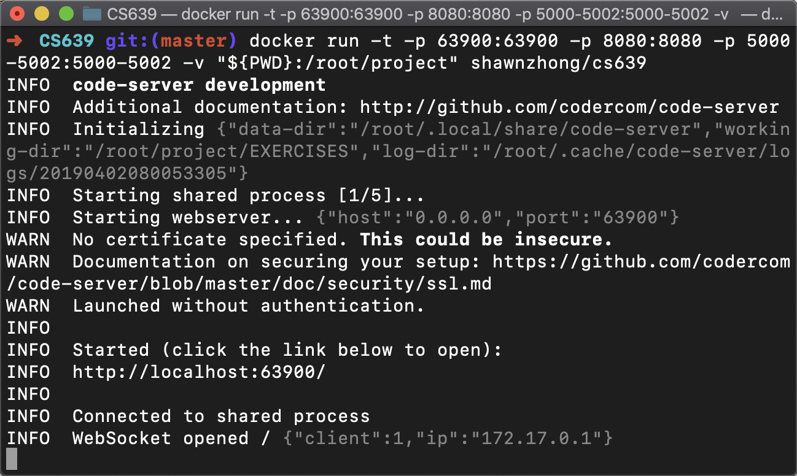
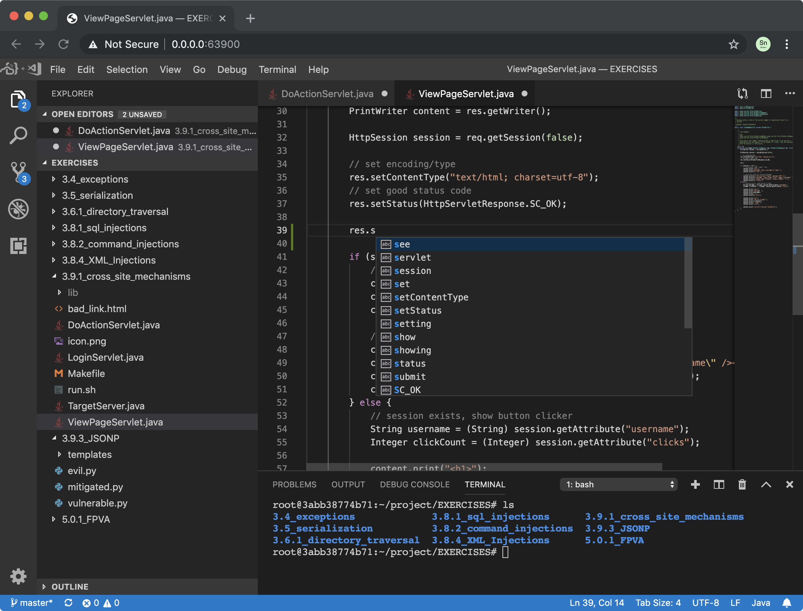
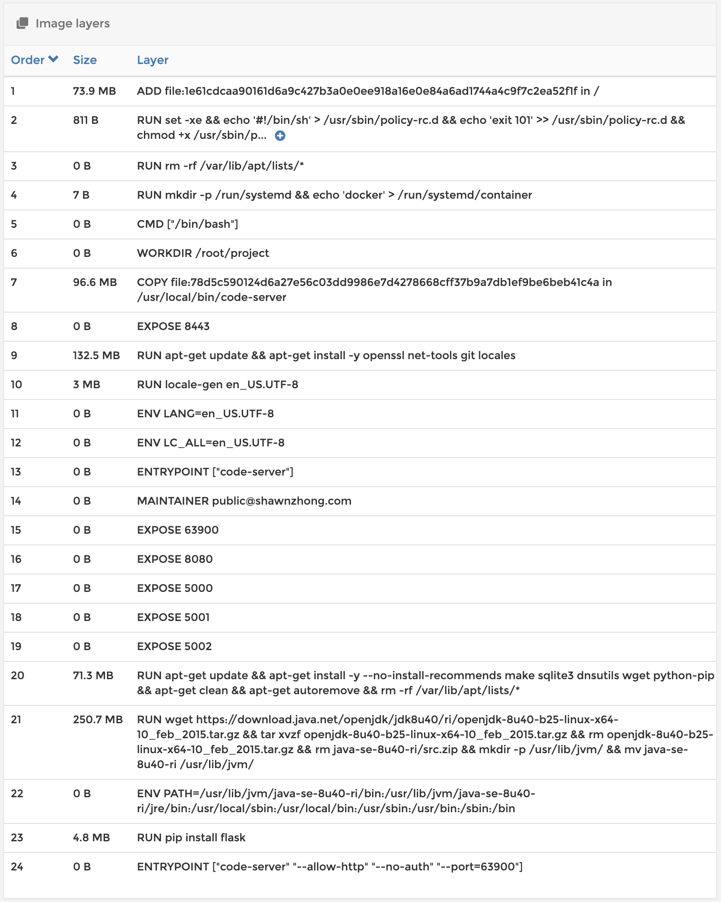

# Docker image for CS 639: Introduction to Software Security

## Introduction

This repo includes all the exercises from [security-exercises-spring2019.ova](http://www.cs.wisc.edu/mist/SoftwareSecurityCourse/Exercises/security-exercises-spring2019.ova) and [security-exercises-2.ova](http://www.cs.wisc.edu/mist/SoftwareSecurityCourse/Exercises/security-exercises-2.ova)

The corresponding docker image contains the minimum set of dependencies to run the codes, including

- A remote version of [VS Code](https://code.visualstudio.com) called [code-server](https://github.com/codercom/code-server)
- `make` to build all the exercises
- `sqlite3` for [Exercise 3.4: Exceptions](https://github.com/ShawnZhong/CS639-Docker/tree/master/EXERCISES/3.4_exceptions) and [Exercise 3.8.1: SQL Injections](https://github.com/ShawnZhong/CS639-Docker/tree/master/EXERCISES/3.8.1_sql_injections)
- `dnsutils`, which includes `nslookup` for [Exercise 3.8.2: Command Injections](https://github.com/ShawnZhong/CS639-Docker/tree/master/EXERCISES/3.8.2_command_injections). This takes roughly 43 MB of the space. Could be optimized in a future version. 
- `python` and `JDK` to execute python and Java program. 
- `flask` for [Exercise 3.9.3 JSONP](https://github.com/ShawnZhong/CS639-Docker/tree/master/EXERCISES/3.9.3_JSONP)

The docker image is only 633 MB, which is significantly smaller than the virtual machine. 

I also separate the runtime environment with the  exercises so that there is no need to redistribute the image when the exercise needs to be changed. 

## How to run

1. Install Docker from <https://docs.docker.com/install/>
2. Clone this repository and cd into it

`git@github.com:ShawnZhong/CS639-Docker.git && cd CS639-Docker `

3. Start the container using the following command

`ddocker run -t --name cs639 -p 63900:63900 -p 8080:8080 -p 5000-5002:5000-5002 -v "${PWD}:/root/project" shawnzhong/cs639 EXERCISES`

4. You can open the link http://localhost:63900 to access the web interface of VSCode. The default working directory is set to the `EXERCISES` folder, so you don't need to manually open it. 

5. If you prefer to use other IDE/editor, you can directly edit your file on your host machine, and run it inside the container. Note: Click Terminal -> New Terminal to open the terminal.   

## Development
To rebuild the Docker image: `docker build . -t shawnzhong/cs639`

You can open the [Dockerfile](<https://github.com/ShawnZhong/CS639-Docker/blob/master/Dockerfile>) to see how I made this image. 

Here is a list of layers inside this image: 

